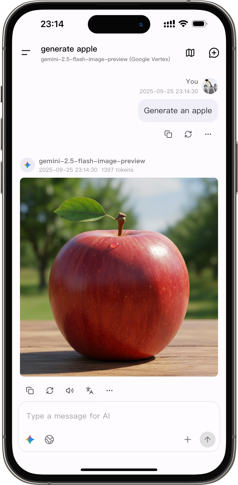
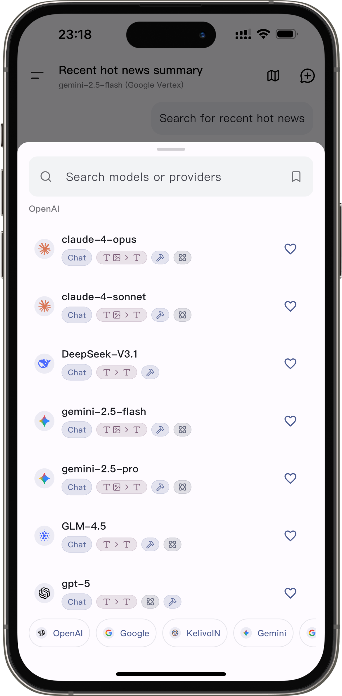
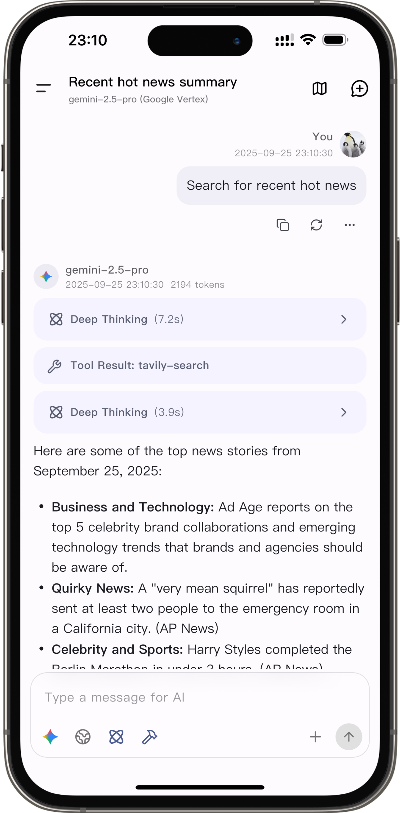
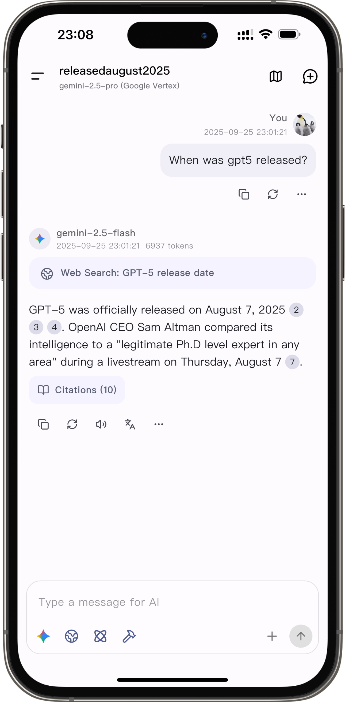



  
  <h1>Kelizo</h1>

A Flutter LLM Chat Client

  
  

English | [简体中文](README_ZH_CN.md)

  
  
  
  

## 🚀 Download

🔗 [Download the latest version](https://github.com/Chevey339/kelizo/releases/latest)

🔗 [TestFlight](https://testflight.apple.com/join/PZZyRMyY) for beta testing.

## 💖 Sponsors

Thanks to [siliconflow.cn](https://siliconflow.cn) for providing free models in cooperation with us.

## ✨ Features

- 🎨 **Modern Design** - Material You design language with dynamic color theming support (Android 12+).
- 🌙 **Dark Mode** - Perfectly adapted dark theme to protect your eyes.
- 🌍 **Multi-language Support** - Supports both English and Chinese interfaces.
- 🖥️ **Multi-platform Support** - Mobile (Android/iOS/Harmony) and Desktop (Windows/macOS/Linux).
- 🔄 **Multi-provider Support** - Supports major AI providers like OpenAI, Google Gemini, Anthropic, etc.
- 🤖 **Custom Assistants** - Create and manage personalized AI assistants.
- 🖼️ **Multimodal Input** - Supports various formats including images, text documents, PDFs, Word documents, etc.
- 📝 **Markdown Rendering** - Full support for code highlighting, LaTeX formulas, tables, and more.
- 🎙️ **Voice/TTS Providers** - Built-in system TTS plus OpenAI / Google Gemini / ElevenLabs voice servers.
- 🛠️ **MCP Support** - Model Context Protocol tool integration.
- 🧰 **Built-in MCP Tools** - Includes a built-in MCP Fetch tool.
- 🔍 **Web Search** - Integrated with multiple search engines (Exa, Tavily, Zhipu, LinkUp, Brave, Bing, Metaso, SearXNG, Ollama, Jina, Perplexity, Bocha).
- 🧩 **Prompt Variables** - Supports dynamic variables like model name, time, etc.
- 📤 **QR Code Sharing** - Export and import provider configurations via QR codes.
- 💾 **Data Backup** - Supports chat history backup and restoration.
- 🌐 **Custom Requests** - Supports custom HTTP request headers and bodies.
- 🔡 **Custom Fonts** - Bring your own fonts (system fonts / Google Fonts).
- ⚙️ **Android Background Generation** - Keep chat generation running in the background (optional setting).

## 📱 Platform Support

- ✅ Android
- ✅ iOS
- ✅ Harmony ([kelizo-ohos](https://github.com/Chevey339/kelizo-ohos))
- ✅ Windows
- ✅ macOS
- ✅ Linux

## 🤝 Contribution Guide

Pull Requests and Issues are welcome!

1. Fork the repository
2. Create your feature branch (`git checkout -b feature/AmazingFeature`)
3. Commit your changes (`git commit -m 'Add some AmazingFeature'`)
4. Push to the branch (`git push origin feature/AmazingFeature`)
5. Open a Pull Request

## ❤️ Acknowledgements

Special thanks to the [RikkaHub](https://github.com/re-ovo/rikkahub) project for the UI design inspiration. Kelizo's interface design is heavily inspired by RikkaHub's beautiful and practical design.

## ⭐ Star History

If you like this project, please give it a star ⭐

## 📄 License

This project is licensed under the AGPL-3.0 License - see the [LICENSE](LICENSE) file for details.

## 📞 Contact Us

- Issue: [GitHub Issues](https://github.com/Chevey339/kelizo/issues)

---

Made with ❤️ using Flutter

